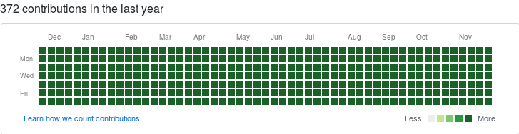

[](http://makeapullrequest.com) 

### Do you want to be a github ninja and commit everyday?
### Are you too lazy to actually make a commit everyday?
### Worry not!
### This script will help you add commits to your github profile so the github contributions graph look more green!

 

How to :
___

* Dont fork the repo.

* Download into your system and extract it OR clone it.

* Create a new repo in your github with the name github-lazy-ninja.

 - DO NOT initialize with readme.
 - copy the https url of the newly created git repo.

* Run the following commands after navigating into 'github-lazy-ninja' the directory from the terminal :

```bash
chmod +x ninja.sh
sudo ./ninja.sh
```

 - The date format is yyyy-mm-dd. example January 16th, 1996 would be written as 1996-01-16

 - Name can be anything, email should be the one registered with your github account.

 - url is the url of the github-lazy-ninja repo you just initialized in github.

Credits : [@tarunvelli](https://github.com/tarunvelli)
